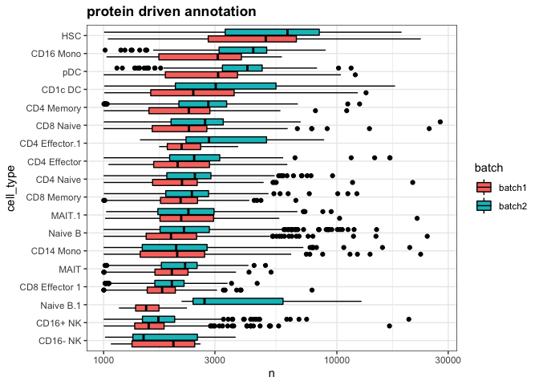
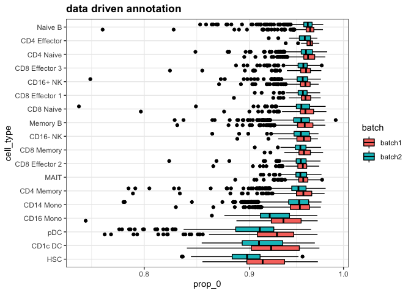
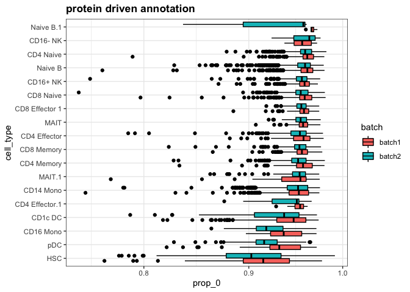
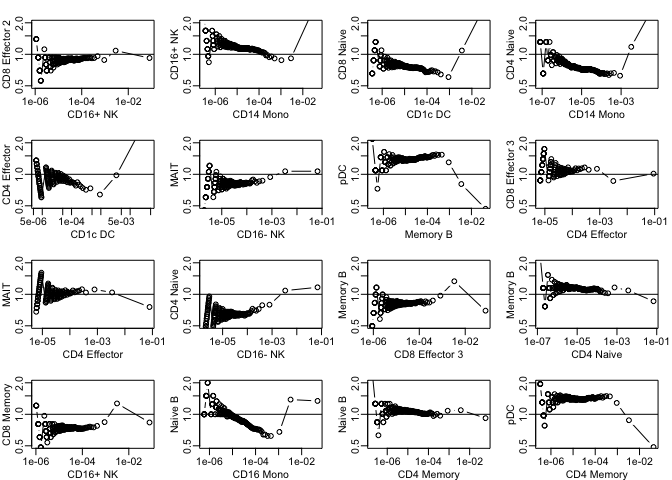
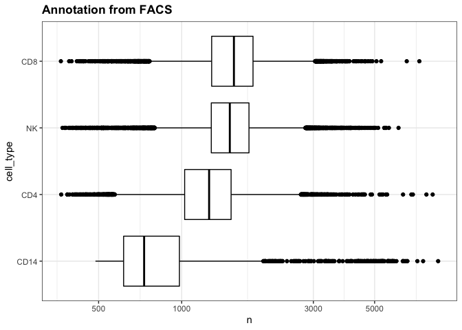
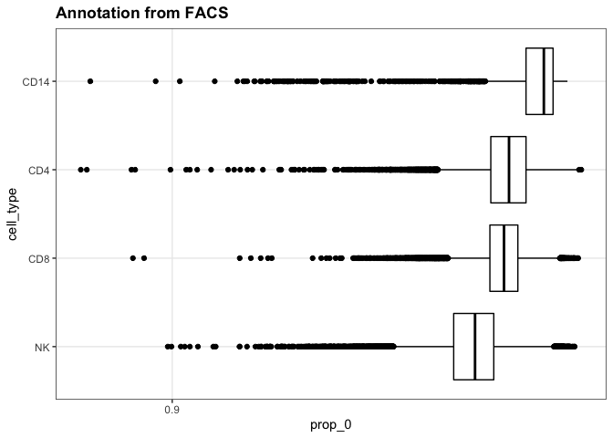
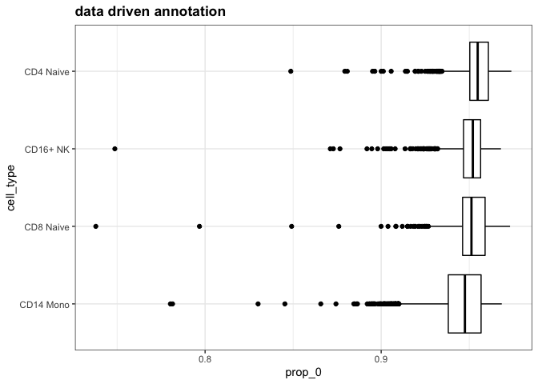
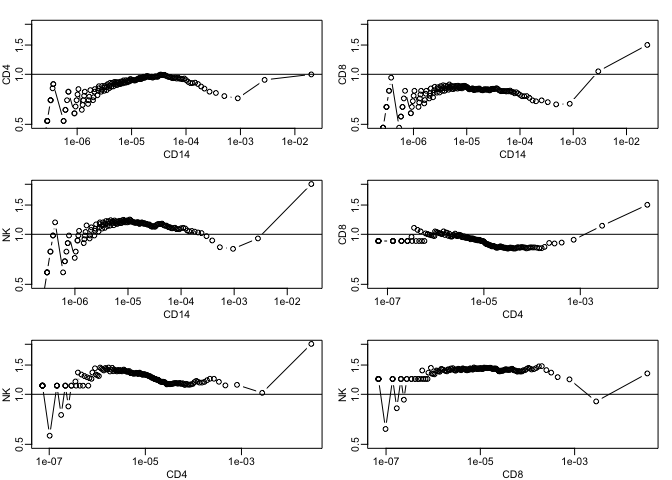

Exploration of how the totla UMIs vary across cell types
================
Rafael Irizarry
11/20/2019

Introduction
------------

Most normalization procedures apply corrections that remove global effects. Here we explore the possibility that some of these global effects are biologically drive. In particular, we explore the total UMIs per cell which, in principle, should be related to cell size, for example.

Read and wrangle data
---------------------

For this code to work the rds and rda files must be in a directory called `rdas` in the home directory of this document.

``` r
tmp <- readRDS("rdas/bm.cite.rds")

## get rid of S4. Make a count matrix and annotation data frame.

pd <- tmp@meta.data
y <- as.matrix(tmp[["RNA"]]@counts)
adt <- as.matrix(tmp@assays$ADT@counts)
pd$celltype[pd$celltype == "CD1C DC"] <- "CD1c DC"
## remove the Prog as they seem very different and obscure the analysis
ind <- which(!grepl("Prog", pd$celltype))
y <- y[,ind]
adt <- adt[,ind]
pd <- pd[ind,]
```

Reannotate data using an approach completely independent of count data
----------------------------------------------------------------------

We will cluster the protein data. We then use the previous annotation to assign it a name, but the point is to define clusters, not to annotate cell-types.

``` r
z <- log2(adt+0.5)
z <- sweep(z, 2, colMeans(z)) ## remove the cell effect... try without
colnames(z) <- pd$celltype
d <- dist(t(z))
K <- length(unique(pd$celltype))
cl <- cutree(hclust(d), k = K)

new_name <- sapply(1:K, function(k){
  tmp <- table(factor(names(cl)[cl==k], levels = unique(pd$celltype)))
  null <- table(factor(pd$celltype, levels =  unique(pd$celltype)))
  names(tmp)[which.max(tmp/null)] #max observed to expected
})
new_name <- make.unique(new_name)

pd$ind_celltype <- new_name[cl]
```

Exploratory Data Analysis
-------------------------

First we make a boxplot of the total counts stratified by celltype annotated using count.

``` r
library(tidyverse)
```

    ## ── Attaching packages ─────────────────────────────────────────────── tidyverse 1.2.1 ──

    ## ✔ ggplot2 3.2.1     ✔ purrr   0.3.2
    ## ✔ tibble  2.1.3     ✔ dplyr   0.8.3
    ## ✔ tidyr   0.8.3     ✔ stringr 1.4.0
    ## ✔ readr   1.3.1     ✔ forcats 0.4.0

    ## ── Conflicts ────────────────────────────────────────────────── tidyverse_conflicts() ──
    ## ✖ dplyr::filter() masks stats::filter()
    ## ✖ dplyr::lag()    masks stats::lag()

``` r
dslabs::ds_theme_set()
data.frame(n = colSums(y), batch = pd$orig.ident, cell_type = pd$celltype) %>%
  mutate(cell_type = reorder(cell_type, n, median)) %>%
  ggplot(aes(cell_type, n, fill = batch)) + 
  geom_boxplot(color = I("black")) + coord_flip() + scale_y_log10() +
  ggtitle("data driven annotation")
```


Next we make a boxplot of the total counts stratified by the new clusters made using exclusively the protein data.

Both plot show strong evidence that cell type have different total number of UMI.

``` r
data.frame(n = colSums(y), batch = pd$orig.ident, cell_type = pd$ind_celltype) %>%
  mutate(cell_type = reorder(cell_type, n, median)) %>%
  ggplot(aes(cell_type, n, fill = batch)) + 
  geom_boxplot(color = I("black")) + coord_flip() + scale_y_log10() +
  ggtitle("protein driven annotation")
```



Next we do the same for the proportion of 0s.

``` r
data.frame(prop_0 = colMeans(y==0), batch = pd$orig.ident, cell_type = pd$celltype) %>%
  mutate(cell_type = reorder(cell_type, prop_0, median)) %>%
  ggplot(aes(cell_type, prop_0, fill = batch)) + 
  geom_boxplot(color = I("black")) + coord_flip() + scale_y_log10() +
  ggtitle("data driven annotation")
```



Now with the independent cluster

``` r
data.frame(prop_0 = colMeans(y==0), batch = pd$orig.ident, cell_type = pd$ind_celltype) %>%
  mutate(cell_type = reorder(cell_type, prop_0, median)) %>%
  ggplot(aes(cell_type, prop_0, fill = batch)) + 
  geom_boxplot(color = I("black")) + coord_flip() + scale_y_log10() +
  ggtitle("protein driven annotation")
```



### Distribution

We now are going to compare the distributions of each cell type. To do this we will compute the proportions of UMIs coming from each gene for each cell type. Note that we add up all the cells of the same cell type. Also note that the difference in total count will not show up here directly as we are computing proportions that add up to 1.

``` r
inds <- split(1:nrow(pd), pd$celltype)

pis <- sapply(inds, function(ind){
  rowSums(y[,ind])/sum(y[,ind])
})
```

We are going to make MA-plot versions of qqplots. The y-axis is the ratio of the quantiles and the x-axis is the average quantile. If these cells have the same distribution points will be on the horizontal line *y* = 1.

We show 16 examples.

``` r
tmp <- gtools::combinations(ncol(pis),2)
tmp <- tmp[sample(nrow(tmp),16),]
maplot <- function(x, y, ...) 
  plot(sqrt(x*y), ifelse(y==0 & x==0, 1, y/x), ...)

rafalib::mypar(4,4)
apply(tmp, 1, function(z){
  i <- z[1]; j<-z[2]
  maplot(
    quantile(pis[,i], seq(0,1,len=250)), 
    quantile(pis[,j], seq(0,1,len=250)),
    log="xy", 
    xlab=colnames(pis)[i], ylab=colnames(pis)[j],
    ylim=c(0.5,2), type="b")
  abline(h=1)
})
```



    ## NULL

These look relatively straight except for the very highly expressed genes.

### FACS

Now we repeat the analysis for FACSorted samples.

``` r
load("rdas/four_pbmcs.rda")
load("rdas/pbmcs_labels.rda")

data.frame(n = colSums(pbmcs_reference), cell_type = pbmcs_reference_labels) %>%
  mutate(cell_type = reorder(cell_type, n, median)) %>%
  ggplot(aes(cell_type, n)) + 
  geom_boxplot(color = I("black")) + coord_flip() + scale_y_log10() +
  ggtitle("Annotation from FACS")
```



We see a cell-specific effect. But let's compare to the previous data:

``` r
data.frame(n = colSums(y), batch = pd$orig.ident, cell_type = pd$celltype) %>%
  filter(cell_type %in% c("CD14 Mono", "CD4 Naive","CD8 Naive","CD16+ NK")) %>%
  mutate(cell_type = reorder(cell_type, n, median)) %>%
  ggplot(aes(cell_type, n)) + 
  geom_boxplot(color = I("black")) + coord_flip() + scale_y_log10() +
  ggtitle("data driven annotation")
```


One concern is that it is not following the same pattern.

Here are the same plots for proportion of 0s

``` r
data.frame(prop_0 = colMeans(pbmcs_reference==0), cell_type = pbmcs_reference_labels) %>%
  mutate(cell_type = reorder(cell_type, prop_0, median)) %>%
  ggplot(aes(cell_type, prop_0)) + 
  geom_boxplot(color = I("black")) + coord_flip() + scale_y_log10() +
  ggtitle("Annotation from FACS")
```



Here are the previous results

``` r
data.frame(prop_0 = colMeans(y==0), batch = pd$orig.ident, cell_type = pd$celltype) %>%
  filter(cell_type %in% c("CD14 Mono", "CD4 Naive","CD8 Naive","CD16+ NK")) %>%
  mutate(cell_type = reorder(cell_type, prop_0, median)) %>%
  ggplot(aes(cell_type, prop_0)) + 
  geom_boxplot(color = I("black")) + coord_flip() + scale_y_log10() +
  ggtitle("data driven annotation")
```



Now let's look at the distributions as before:

``` r
inds <- split(seq_along(pbmcs_reference_labels), pbmcs_reference_labels)

pis <- sapply(inds, function(ind) rowSums(pbmcs_reference[,ind])/sum(pbmcs_reference[,ind]))

rafalib::mypar(3,2)
maplot <- function(x, y, ...) 
  plot(sqrt(x*y), y/x, ...)
for(i in 1:(ncol(pis)-1)){
  for(j in (i+1):ncol(pis)){
    maplot(
      quantile(pis[,i], seq(0,1,len=250)), 
      quantile(pis[,j], seq(0,1,len=250)),
      log="xy", 
      xlab=colnames(pis)[i], ylab=colnames(pis)[j],
      ylim=c(0.5,2), type="b")
    abline(h=1)
  }}
```


